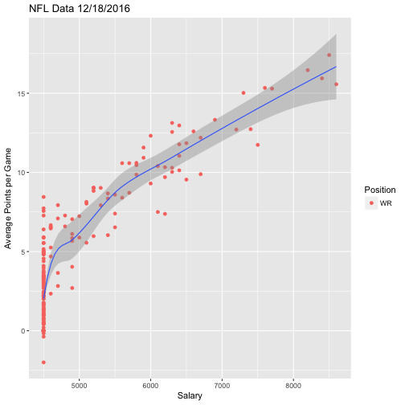

## Overview

This project is designed to give an graphical representation of NFL player's daily fantasy salary compared to their respective average daily fantasy points. This is broken down by position, according to FanDuel.
After plotting the players, a regression line is drawn. This is great, as visual learners can see which players are above average for their position, and which aren't.

---

## Data Sources
The data comes from FanDuel's website for the "Main" entry pool of NFL games on Sunday, December 18th 2016.
FanDuel is nice enough to provide a CSV file for this data, which is unlinkable, but is included in the github repo and hosted here:

(https://www.dropbox.com/s/px1yv5ioqj79i2l/playerData.csv)


```
## Loading required package: ggplot2
```

```
## 
## Attaching package: 'plotly'
```

```
## The following object is masked from 'package:ggplot2':
## 
##     last_plot
```

```
## The following object is masked from 'package:stats':
## 
##     filter
```

```
## The following object is masked from 'package:graphics':
## 
##     layout
```

```r
summary(mydata$Position)
```

```
##   D   K  QB  RB  TE  WR 
##  26  26  82 156 130 193
```

---

## Calculations
Here, we plot the players Salary (x-axis) against their Average Fantasy Points (FFPG) (y-axis) and then add our regression line. "input$position" allows for user input, part of the assignment. The code is shown below:


```r
mydata <- subset(mydata, Position == input$position)
ggplot(data = mydata, aes(x = Salary, y = FPPG, label = LastName)) + 
  geom_point(aes(colour = Position)) +
  geom_smooth(size = .5, method = loess) +
  xlab("Salary") +
  ylab("Average Points per Game") + 
  ggtitle("NFL Data 12/18/2016")
```

---

## Output
The final output will be a shiny app that will include a brief explanation, a radio input block for the user to select which position they would like to see charted. This will then show the different players of that position graphed with their salary and average points per game. You can see a working version here:

(https://hhassig.shinyapps.io/project_week_4/)


